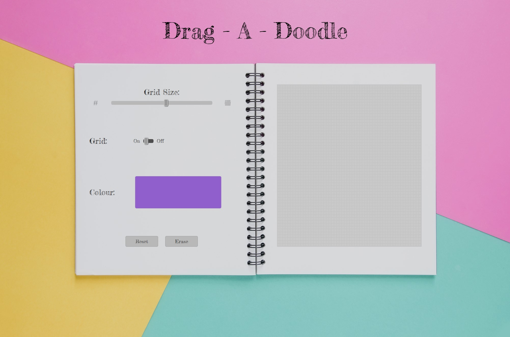
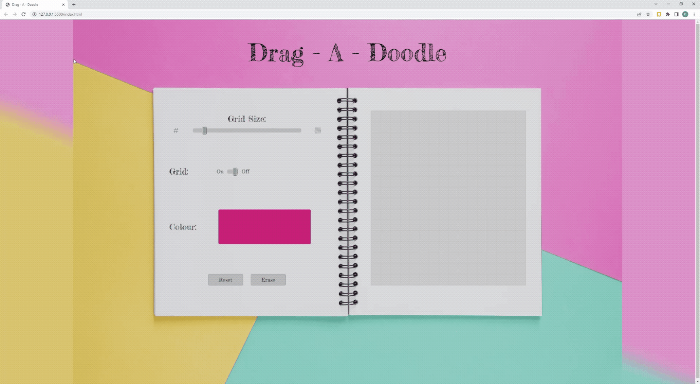
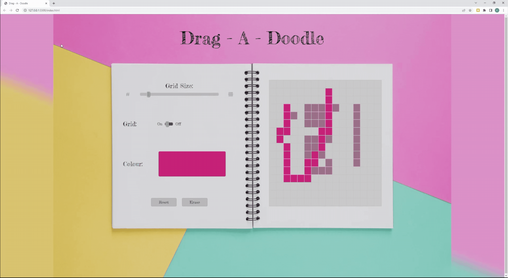
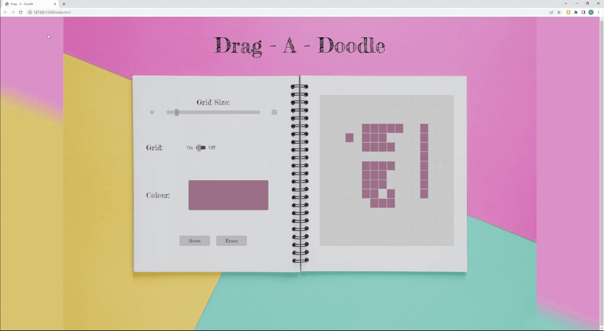
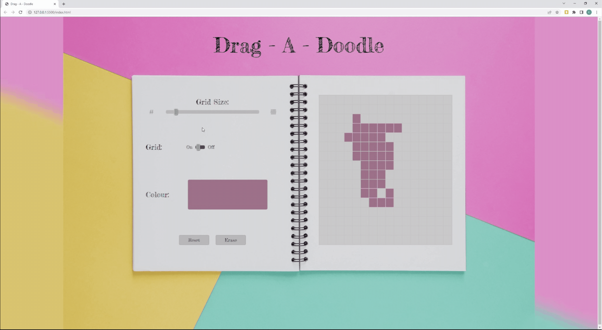

# **The Odin Project =>** *Drag-A-Doodle* (Etch-A-Sketch)
*Drag - A - Doodle* is my take on the classic *Etch-A-Sketch* drawing game. The player should be able to set a grid/pixel size for the drawing board, draw and erase with the mouse, pick and change colours as well as reset the board once done. 

This challenge is part of The Odin Projects foundation course, it gives basic prompts on what to do but leaves how to implement your ideas completely open and as such is a daunting task to a beginner. 

I have made the game as responsive to screen size as possible but best displayed and played on a computer rather than tablet or mobile as I could not get the pointer events to work as well as the current mouse events.

---

## Instructions:
* Choose a grid size
* Toggle your grid lines on or off, even while you draw!
* Pick as many colours as you wish
* Just drag to draw and erase!
#### Create your own: **[Play Here!](https://capetownkimmy.github.io/Drag-A-Doodle/)**

---
## Features:
###### The screen capture is very low quality, please try out the game for a better experience!
#
### Interactive grid size slider that updates on demand.

#
### Toggle the grid on/off - works while you draw without resetting your image.

#
### Interactive colour picker. Choose any colour and draw! (screen capture did not pick up the colour selection pop-up).

#
### An erase function that switches back to the pen automatically when you stop erasing.

#
---
## Software & Skills:
* HTML
* CSS
* JavaScript
* Figma
* VS Code
* Git
* GitHub
