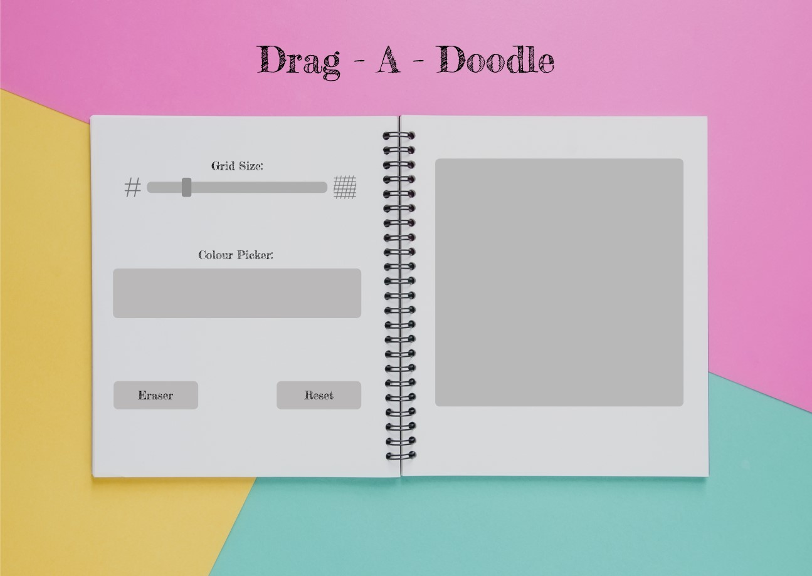

# **The Odin Project =>** *Drag-A-Doodle* (Etch-A-Sketch)
*Drag - A - Doodle* is my take on the classic *Etch-A-Sketch* drawing game. The player should be able to set a grid/pixel size for the drawing board, draw and erase with the mouse, pick and change colours as well as reset the board once done. 

This challenge is part of The Odin Projects foundation course, it gives basic prompts on what to do but leaves how to implement your ideas completely open and as such is a daunting task to a beginner.

---

I have kept my initial design quite simple and open so that I can adapt as needed. Controls and selection on the left and the grid onn the right of the notebook.

---
## Software & Skills:
* HTML
* CSS
* JavaScript
* Figma
* VS Code
* Git
* GitHub
